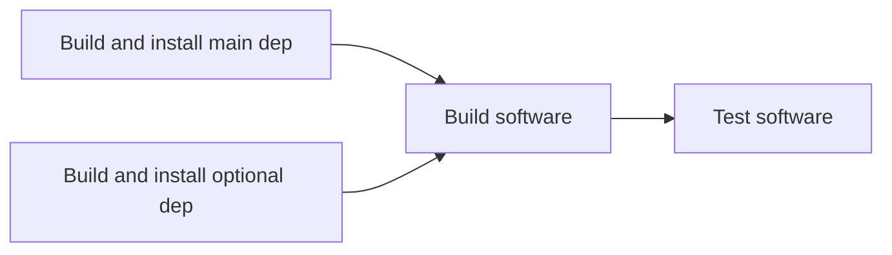
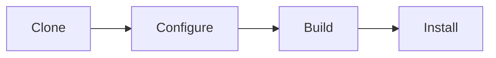
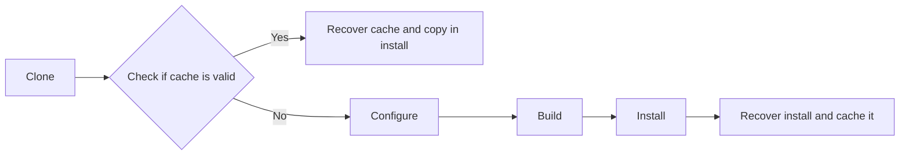
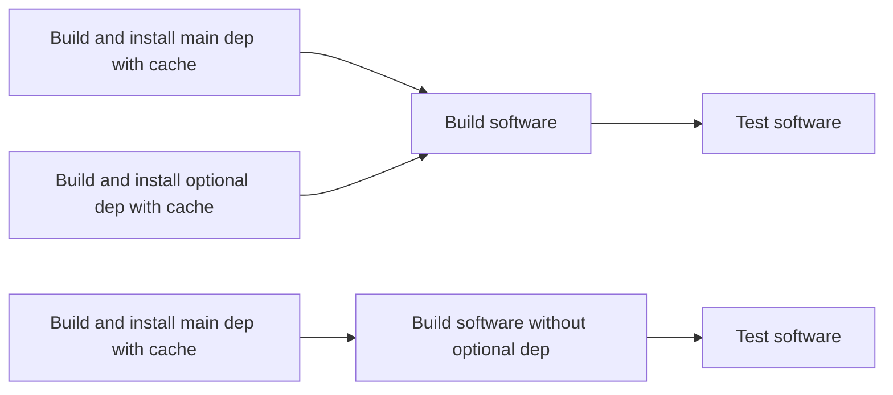
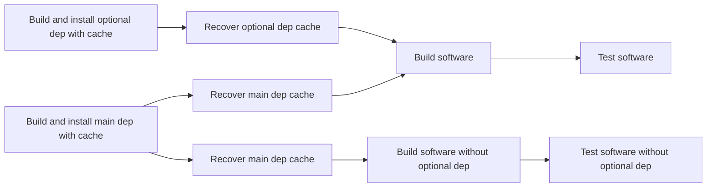
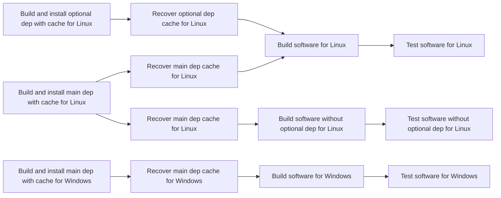

# Efficient And Scalable CI with dependencies

This is a design document explaining how to create an complete, efficient and scalable CI for a compiled software
requiring the use of dependencies.

It focuses on C++ and GitHub actions CI but the concepts are applicable to any compiled language and any CI system.

## The software stack

Let's use an idealized, simplified software stack where one software depends on one "main" dependency and one "optional"
dependency.

A "main" dependency is something like a framework, wich is non-optional and of which checking that all versions are tested is critical.
An "optional" dependency is something like a library providing additional feature and that can be enabled in the software at configuration time
and of which it matters to test with the version being shipped and the minimum version.

## Step 1: Make it work

A simple CI that works for this stack would be as follows:

Each dependency step being just:

It works great, however, build the dependencies on every CI run is incredebly wasteful, as they usually do not change version and the results is the same.
This is why we need a cache.

## Step 2: Using a cache

A cache is simple concept in CI where, when doing something, you recover that something and store it somewhere, so that the next time you do it, instead of doing it, you recover it,
which is much faster.

So when building any dependencies above, instead of cloning, configuring, building, installing, we could instead:

It creates a very fast CI where most of the run only recover caches from dependency and build only the software.
Of course, it means that when we change the version of the dependency, the cache must be invalidated, this is usually done using some kind of key containing the version of the dependency.

## Step 3: Many builds

While we currently have a single build, the reality is that often many configuration must be built and tested.
For the sake of brevity we will simplify with a single variation here but in real world case, there would be many.

So let's imagine we want to check the optional dependency truly is optional, so we build this:

And it works great! However, when we change the version of the main dependency, then its cache will be invalidated, which will result on a simultaneous build of the main dependencies, building it effectively two times (actually, many times) instead of building it once where it would have been enough, before then using the dependency cache.

A solution for that is "cache pre-heating" where we ensure the caches are ready before doing the proper CI.

In certain CI system (such as gitlab), the pre-heating part is designed in and not really needed, but in github actions, it really is not when using the matrix mechanism.

## Step 4: Cache pre-heating

In order to ensure the cache are ready before being used in the proper CI, we can add a dedicated step for that, it would look like this:

This way, the main dependency will be built only once and further steps will only ever recover the cache.

## Step 5: Making it cross-platform

With compiled language, the platform (as in, Linux, macOS, Windows) matters a lot and testing for all platforms is critical, so lets integrate it in our workflows:

It stills works great and can scale up properly, however, in real-world implementation, those cross-platform cache-preheating steps are usually done using a matrix system.
This is specific to github actions and may not be an issue on other CI systems. The next sections are github specific.

So in the case of using a matrix, the "Build and install main dep with cache" steps, although very fast when cache is already computed, still requires a runner to pick the job to check.
Obviously this runner is of the needed platform in case the cache needs to be rebuilt, which means that the cache pre-heating steps act as some kind of a cross platform barrier, preventing
high available runner (such as Linux generally) to start working until all caches have been checked.

## Step 6: Splitting the matrix and handling of versions

The obvious solution of the cross-platform cache pre-heating barrier is NOT to use a matrix in that case, but it can mean lots and lots of duplication of CI code, as matrix are used indeed for a reason.
Indeed, most of the top-level CI code at this point is not the CI logic but the transfer of the information of the version to build, as this information should be centralized somewhere for easier update.

There are different ways to do that, but F3D does it using a JSON file parsed using jq.

Splitting the matrix would mean duplicating the version information many more times, so a solution is to NOT parse early buit instead parse only when needed using a dedicated code (github action).
This make the cache pre-heating step is way less verbose and can be splitted without duplicated hunderds of CI code.

But it also means cache pre-heating could be even more efficient.

## Step 7: Cache pre-heating for everyone

If the cache pre-heating step is less verbose, it also means it is not bound to evolve much.
Cache in github is stored "by branch" and only hit master/main branch once the branch is merged.
When updating a dependency, it means the cache is created once in the branch, then created again on the merge, building it two times for no reason.

Using a `pull_request_target` workflow for cache pre-heating let the cache being built directly on the main/master branch for everyone to use right away.

This means that creating a bad cache would also impact everyone so cache pre-heating should be restricted to maintainers only.
