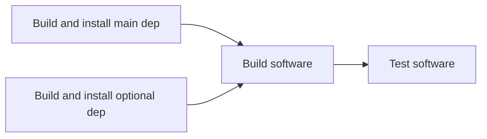
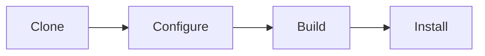
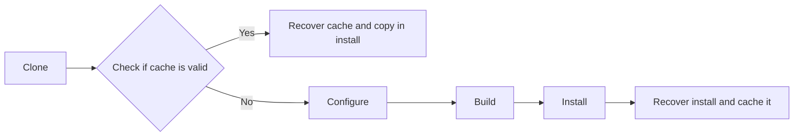
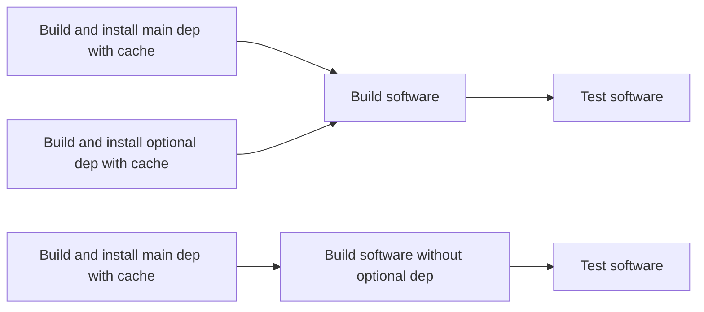
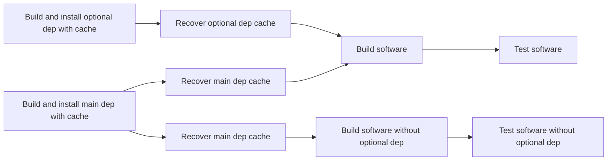
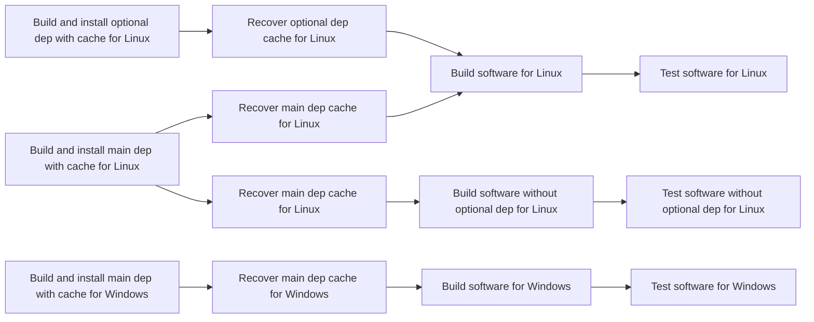
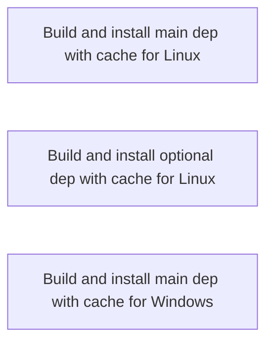
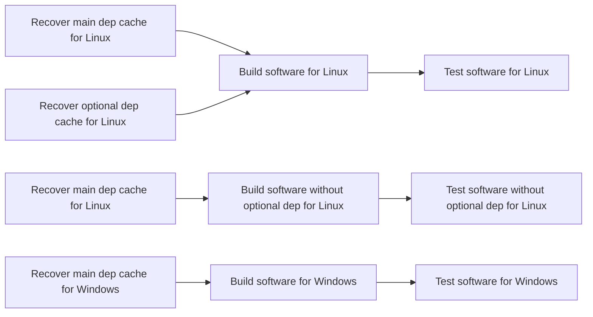

# Efficient And Scalable CI with dependencies

This is a design document explaining how to create a complete, efficient and scalable CI for a compiled software
requiring the use of dependencies.

It focuses on C++ and GitHub actions CI but the concepts are applicable to any compiled language and any CI system.

## The software stack

Let's use an idealized, simplified software stack where one software depends on one "main" dependency and one "optional"
dependency.

A "main" dependency is something like a framework, which is non-optional and of which checking that all versions are tested is critical.
An "optional" dependency is something like a library providing additional feature and that can be enabled in the software at configuration time
and of which it matters to test with the version being shipped and the minimum version.

## Step 1: Make it work

A simple CI that works for this stack would be as follows:

Each dependency step being just:

It works great, however, build the dependencies on every CI run is incredibly wasteful, as they usually do not change version and the result is the same.
This is why we need a cache.

## Step 2: Using a cache

A cache is simple concept in CI where, when doing something, you generate something and store it somewhere, so that the next time you do it, instead of doing it, you recover it,
which is much faster.

Both github actions and gitlab CI support caches.

So when building any dependencies above, instead of cloning, configuring, building, installing, we could instead:

It creates a very fast CI where most of the run only recover caches from dependency and build only the software.
Of course, it means that when we change the version of the dependency, the cache must be invalidated, this is usually done using some kind of key containing the version of the dependency.

## Step 3: Many builds

While we currently have a single build, the reality is that often many configuration must be built and tested.
For the sake of brevity we will simplify with a single variation here but in real world case, there would be many.

So let's imagine we want to check the optional dependency truly is optional, so we build this:

And it works great! However, when we change the version of the main dependency, then its cache will be invalidated, which will result on a simultaneous build of the main dependencies, building it effectively twice (actually, many times) instead of building it once where it would have been enough, before then using the dependency cache.

A solution for that is "cache preheating" where we ensure the caches are ready before doing the proper CI.

## Step 4: Cache preheating

In order to ensure the caches are ready before being used in the proper CI, we can add a dedicated step for that, it would look like this:

This way, the main dependency will be built only once and further steps will only ever recover the cache.

## Step 5: Making it cross-platform

With compiled language, the platform (as in, Linux, macOS, Windows) matters a lot and testing for all platforms is critical, so lets integrate it in our workflows:

It still works great and can scale up properly, however, in real-world implementation, those cross-platform cache-preheating steps are usually done using a matrix system.
Both github actions and gitlab CI support matrix systems.

So in the case of using a matrix, the "Build and install main dep with cache" steps, although very fast when cache is already computed, still requires a runner to pick the job to check.
Obviously this runner must be of the needed platform in case the cache needs to be rebuilt, which means that the cache preheating steps act as some kind of a cross platform barrier, preventing
high availability runners to start working until all caches have been checked.

## Step 6: Splitting the matrix and handling of versions

The obvious solution of the cross-platform cache preheating barrier is NOT to use a matrix in that case, but it can mean lots and lots of duplication of CI code, as matrix are used indeed for a reason.
The resulting chart is the same as above however the actual implementation is very different with lot of duplication.

Indeed, most of the top-level CI code at this point is not the CI logic but the transfer of the information of the version to build, as this information should be centralized somewhere for easier update.
There are different ways to do that, but F3D does it using a JSON file parsed using `jq`.

Splitting the matrix would mean duplicating the version information many more times, so a solution is to NOT parse early but instead parse only when needed using a dedicated code.
This make the cache preheating step way less verbose and can be split without duplicated hundreds of lines of CI code.

But it also means cache preheating could be even more efficient.

## Step 7: Cache preheating for everyone

Instead of handling cache preheating by branch, we could consider building it once and them making it availaible for everyone.

In gitlab CI, this is handled in security settings.
In github actions, this require the uses of a `pull_request_target` workflow that also comes with security concerns.
So let's assume only trusted contributors can run this workflow and no cache poisonning can occur.

It now means that when updating a dependency, instead of creating the cache in the branch, then creating again once the branch is merged,
we can build the cache only once and make it available right away.

So here is how it looks:

This way, the caching part is a disconnected workflow, this is maintainers only.
It is run on the master/main branch and is available for everyone to use as soon as it is done, using the version information from the branch from the request.

If, for some reason, the cache is not available, the "Recover cache" steps are still able to build, but we all the caveats mentioned in the previous steps.

## Conclusion

We have shown that, even in a pretty simple usecase, looking for optimizing compilation occurrence in a CI context, in a cross-platform environment let specific patterns
occur and that using proper cache preheating is a scalable solution than can be deployed in different CI systems.

A live implementation (github actions) is available on the [F3D repository](https://github.com/f3d-app/f3d/blob/master/.github/workflows/cache-preheating.yml).
